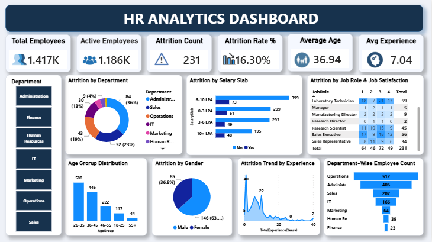

# HR Analytics & Attrition Dashboard

## Gambaran Umum

Project Business Intelligence menggunakan Microsoft Power BI dengan menganalisis data karyawan untuk memahami distribusi workforce dan pola employee attrition berdasarkan berbagai karakteristik, seperti department, salary slab, job role, job satisfaction, gender, age group, dan work experience.

Proses pengolahan data dilakukan secara langsung di Power BI menggunakan Power Query. Data yang telah dipreprocess kemudian digunakan untuk membangun dashboard interaktif yang menyajikan KPI dan berbagai visualisasi HR analytics untuk memberikan gambaran mengenai kondisi workforce dan attrition dari berbagai perspektif HR.

## Dataset

- **Sumber**: HR Employee Attrition on Kaggle
- **Jenis Data:** Data karyawan dan employee attrition
- **Cakupan:** Informasi demografis, karakteristik pekerjaan, tingkat kepuasan kerja, kompensasi, masa kerja, department, serta status attrition karyawan.
- [View Dataset on Google Drive](https://drive.google.com/drive/folders/1C7JBsvYOPiV4eEVork-RMbUBulK-Ho5W?hl=ID)

## Data Preprocessing

Data preprocessing dilakukan menggunakan **Power Query** melalui fitur **Transform Data** di Power BI.

Tahapan preprocessing meliputi:

- Changing data types
- Removing unnecessary rows
- Removing duplicates
- Replacing values
- Removing unnecessary columns
- Creating conditional columns

## Tujuan Analisis

Analisis dilakukan untuk emngembangkan dashboard interaktif menggunakan Microsoft Power BI untuk memberikan overview mengenai workforce dan employee attrition yang mencakup 6 key HR metrics:

| KPI | Value |
|---|---:|
| Total Employees | **1,417** |
| Active Employees | **1,186** |
| Attrition Count | **231** |
| Attrition Rate | **16.30%** |
| Average Age | **36.94** |
| Average Experience | **7.04 years** |

Dashboard menyediakan berbagai visualisasi untuk menganalisis employee attrition dan workforce distribution, meliputi:

- Attrition by Department
- Attrition by Salary Slab
- Attrition by Job Role & Job Satisfaction
- Age Group Distribution
- Attrition by Gender
- Attrition Trend by Experience
- Department-wise Employee Count

Dashboard juga dilengkapi dengan **Department filter** untuk memungkinkan eksplorasi data berdasarkan masing-masing department.

### Dashboard Preview



## Tools & Techniques

- Microsoft Power BI
- Power Query
- Data Preprocessing
- Data Transformation
- Data Visualization
- Business Intelligence
- Dashboard Development

## Alur Analisis

```text
Raw Data
    ↓
Power Query
    ↓
Data Preprocessing & Transformation
    ↓
Data Analysis
    ↓
Power BI Visualization
    ↓
Insights
